```mermaid
flowchart LR
    A["📁 Recipe Folder"] --> B["agents.yaml"]
    A --> C["tools.py"]
    B --> D["🤖 Agents"]
    B --> E["📋 Steps"]
    B --> F["📦 Metadata"]
    C --> G["🔧 Custom Tools"]
    C --> H["📊 Variables"]
    
    style A fill:#8B0000,color:#fff
    style B fill:#189AB4,color:#fff
    style C fill:#189AB4,color:#fff
    style D fill:#8B0000,color:#fff
    style E fill:#8B0000,color:#fff
    style F fill:#8B0000,color:#fff
    style G fill:#189AB4,color:#fff
    style H fill:#189AB4,color:#fff
```

# PraisonAI Recipe Development Guide

> **For AI Agents**: Complete reference for building, testing, optimizing, and deploying PraisonAI recipes from scratch.

---

## 1. Recipe Structure

A PraisonAI recipe is a folder containing **2 files**:

```
my-recipe/
├── agents.yaml    # Agent definitions, workflow, and metadata
└── tools.py       # Custom functions and dynamic variables
```



---

## 2. agents.yaml Complete Reference

### 2.1 Full Structure

```yaml
# OPTIONAL: Metadata for registry/sharing
metadata:
  name: recipe-name           # Unique identifier (lowercase, hyphens)
  version: "1.0.0"            # Semantic version
  description: What this does # Brief description
  author: your-name           # Author name
  license: Apache-2.0         # License type
  tags:                       # Searchable tags
    - category1
    - category2
  requires:                   # Dependencies
    env:                      # Required environment variables
      - OPENAI_API_KEY
    tools:                    # Required tool packages
      - praisonai-tools

# REQUIRED: Framework identifier
framework: praisonai

# REQUIRED: Topic/context
topic: "your topic here"

# OPTIONAL: Global variables
variables:
  default_url: "https://example.com"
  max_results: 10

# REQUIRED: Agent definitions
agents:
  agent_name:                 # Unique agent identifier
    role: Role Title          # Agent's role
    goal: What agent achieves # Agent's objective
    backstory: |              # Agent's background/expertise
      Multi-line description of the agent's
      expertise and approach.
    tools:                    # Tools this agent can use
      - tool_name_1
      - tool_name_2
    llm: gpt-4o-mini          # LLM model (optional)
    memory: false             # Enable memory (optional)
    knowledge:                # Knowledge sources (optional)
      - ./docs/manual.pdf
      - https://example.com/api

# REQUIRED: Workflow steps
steps:
  - agent: agent_name
    action: "Specific task description with {{variable}} substitution"
    expected_output: "Exact format/content expected"
```

### 2.2 Agent Configuration Options

| Field | Required | Description |
|-------|----------|-------------|
| `role` | Yes | Agent's role title |
| `goal` | Yes | What the agent aims to achieve |
| `backstory` | Yes | Background and expertise |
| `tools` | No | List of tool names |
| `llm` | No | LLM model (default: gpt-4o-mini) |
| `memory` | No | Enable memory (true/false) |
| `knowledge` | No | Knowledge sources (files/URLs) |
| `instructions` | No | Additional instructions |
| `verbose` | No | Enable verbose output |

### 2.3 Step Configuration Options

| Field | Required | Description |
|-------|----------|-------------|
| `agent` | Yes | Agent name to execute |
| `action` | Yes | Task description |
| `expected_output` | Yes | Expected output format |
| `context` | No | Additional context |
| `max_retries` | No | Retry count on failure |

### 2.4 Variable Substitution

Use `{{variable}}` syntax for dynamic content:

```yaml
variables:
  topic: "AI trends"
  year: "2024"

steps:
  - agent: researcher
    action: "Research {{topic}} for {{year}}"
    expected_output: "Report on {{topic}}"
```

**Built-in Variables:**
- `{{today}}` - Current date (January 26, 2026)
- `{{date}}` - ISO date (2026-01-26)
- `{{time}}` - Current time
- `{{datetime}}` - Full datetime
- `{{year}}` - Current year
- `{{month}}` - Current month name
- `{{topic}}` - From topic field
- `{{input}}` - User input
- `{{agent_name_output}}` - Previous agent's output

### 2.5 Context Flow Between Agents

Pass output from one agent to the next:

```yaml
steps:
  - agent: researcher
    action: "Use internet_search to find AI trends. Return a numbered list."
    expected_output: "Numbered list of 5 trends with descriptions"

  - agent: writer
    action: "Using findings: {{researcher_output}}, write a blog post."
    expected_output: "Markdown blog post with headings"
```

---

## 3. tools.py Complete Reference

### 3.1 Basic Structure

```python
"""Custom tools for this recipe."""

# Import required libraries
from typing import Optional

# Define custom tools
def my_custom_tool(query: str, limit: int = 10) -> str:
    """
    Tool description - this becomes the tool's docstring.
    
    Args:
        query: Search query
        limit: Maximum results
        
    Returns:
        Search results as string
    """
    # Implementation
    return f"Results for: {query}"

# Define dynamic variables
DEFAULT_URL = "https://example.com"
MAX_RETRIES = 3

# Export tools for the recipe
def get_all_tools():
    """Get all tools defined in this recipe."""
    return [my_custom_tool]
```

### 3.2 Tool Function Requirements

1. **Type hints required** - All parameters must have type hints
2. **Docstring required** - Describes what the tool does
3. **Return type** - Should return string or JSON-serializable data
4. **Error handling** - Handle errors gracefully

### 3.3 Using Built-in Tools

Reference built-in tools by name in agents.yaml:

**Web Search:**
- `internet_search` - DuckDuckGo search
- `tavily_search` - Tavily AI search
- `exa_search` - Exa semantic search

**Web Scraping:**
- `scrape_page` - Extract content from URL
- `extract_links` - Get all links from page
- `crawl4ai` - Async web crawling

**File Operations:**
- `read_file` - Read file contents
- `write_file` - Write to file
- `list_files` - List directory contents

**Data Processing:**
- `read_csv` - Read CSV file
- `write_csv` - Write CSV file
- `read_json` - Read JSON file

**Research:**
- `search_arxiv` - Search arXiv papers
- `wiki_search` - Search Wikipedia

---

## 4. Creating a Recipe from Scratch

### Step 1: Create Recipe Folder

```bash
mkdir my-recipe
cd my-recipe
```

### Step 2: Create agents.yaml

```yaml
metadata:
  name: my-recipe
  version: "1.0.0"
  description: My first recipe
  author: your-name
  license: Apache-2.0
  tags:
    - example
  requires:
    env:
      - OPENAI_API_KEY

framework: praisonai
topic: "example task"

agents:
  assistant:
    role: AI Assistant
    goal: Complete the assigned task
    backstory: |
      A helpful AI assistant with expertise in
      completing tasks efficiently and accurately.
    tools:
      - internet_search
      - write_file
    llm: gpt-4o-mini

steps:
  - agent: assistant
    action: "Use internet_search to find information about {{topic}}. Summarize the top 3 findings."
    expected_output: "A numbered list of 3 key findings with brief descriptions"
```

### Step 3: Create tools.py

```python
"""Custom tools for my-recipe."""

def custom_formatter(text: str, style: str = "bullet") -> str:
    """
    Format text in the specified style.
    
    Args:
        text: Text to format
        style: Format style (bullet, numbered, heading)
        
    Returns:
        Formatted text
    """
    lines = text.strip().split('\n')
    if style == "bullet":
        return '\n'.join(f"• {line}" for line in lines)
    elif style == "numbered":
        return '\n'.join(f"{i+1}. {line}" for i, line in enumerate(lines))
    elif style == "heading":
        return '\n'.join(f"## {line}" for line in lines)
    return text

# Dynamic variables
DEFAULT_STYLE = "bullet"

def get_all_tools():
    """Get all tools defined in this recipe."""
    return [custom_formatter]
```

---

## 5. Running a Recipe

### 5.1 CLI Commands

```bash
# Run a recipe
praisonai recipe run my-recipe

# Run with input
praisonai recipe run my-recipe --var topic="AI trends"

# Run with trace saving (for debugging/judging)
praisonai recipe run my-recipe --save

# Run with custom trace name
praisonai recipe run my-recipe --save --name my-test-run

# Run with verbose output
praisonai recipe run my-recipe --verbose

# Dry run (validate without executing)
praisonai recipe run my-recipe --dry-run
```

### 5.2 Python API

```python
from praisonai import recipe

# Simple run
result = recipe.run("my-recipe")

# With input
result = recipe.run("my-recipe", input={"topic": "AI trends"})

# Check result
if result.ok:
    print(result.output)
else:
    print(f"Error: {result.error}")

# With options
result = recipe.run(
    "my-recipe",
    input={"topic": "AI"},
    options={
        "save_replay": True,
        "trace_name": "my-test",
        "verbose": True,
    }
)
```

---

## 6. Testing and Judging Recipes

### 6.1 Save Execution Trace

```bash
# Run with trace saving
praisonai recipe run my-recipe --save
# Output: 📝 Replay trace saved: run-abc123
```

### 6.2 Judge the Trace

```bash
# Judge with context flow evaluation (default)
praisonai recipe judge run-abc123

# Judge with memory evaluation
praisonai recipe judge run-abc123 --memory

# Judge with knowledge evaluation
praisonai recipe judge run-abc123 --knowledge

# Generate fix plan
praisonai recipe judge run-abc123 --yaml agents.yaml --output plan.yaml
```

### 6.3 Judge Output Interpretation

| Score | Quality | Action |
|-------|---------|--------|
| 9-10 | Excellent | Ready for production |
| 7-8 | Good | Minor improvements possible |
| 5-6 | Fair | Needs optimization |
| 1-4 | Poor | Significant issues |

### 6.4 Evaluation Criteria

**Task Achievement (1-10):**
- Did the agent complete the assigned task?
- Was the output correct and complete?

**Context Utilization (1-10):**
- Did the agent use provided context effectively?
- Was information passed correctly between agents?

**Output Quality (1-10):**
- Does output match expected format?
- Is the content useful and accurate?

**Instruction Following (1-10):**
- Did the agent follow specific instructions?
- Were constraints respected?

**Error Handling (1-10):**
- How well did the agent handle errors?
- Were edge cases addressed?

---

## 7. Optimizing Recipes

### 7.1 Automatic Optimization

```bash
# Optimize with defaults (3 iterations, threshold 8.0)
praisonai recipe optimize my-recipe

# Optimize with specific target
praisonai recipe optimize my-recipe "improve error handling"

# More iterations, higher threshold
praisonai recipe optimize my-recipe --iterations 5 --threshold 9.0

# With test input
praisonai recipe optimize my-recipe --input '{"query": "test"}'
```

### 7.2 Optimization Loop


### 7.3 Manual Optimization

1. **Run with trace:**
   ```bash
   praisonai recipe run my-recipe --save
   ```

2. **Judge the trace:**
   ```bash
   praisonai recipe judge run-abc123 --yaml agents.yaml --output plan.yaml
   ```

3. **Review the plan:**
   ```bash
   cat plan.yaml
   ```

4. **Apply fixes:**
   ```bash
   praisonai recipe apply plan.yaml
   ```

---

## 8. Applying Fixes

### 8.1 Apply Command

```bash
# Preview changes
praisonai recipe apply plan.yaml --dry-run

# Apply with confirmation
praisonai recipe apply plan.yaml

# Apply without confirmation
praisonai recipe apply plan.yaml --confirm

# Apply specific fixes only
praisonai recipe apply plan.yaml --fix-ids fix_001,fix_002

# Apply without backup
praisonai recipe apply plan.yaml --no-backup
```

### 8.2 Plan File Format

```yaml
session_id: run-abc123
timestamp: "2026-01-26T07:30:00"
yaml_file: agents.yaml
fixes:
  - id: fix_001
    agent: researcher
    field: action
    current: "Research the topic"
    proposed: "Use internet_search to find the latest information about {{topic}}. Return top 5 results."
    reason: "Action too vague - needs specific tool and output format"
  - id: fix_002
    agent: writer
    field: expected_output
    current: "A report"
    proposed: "A well-structured Markdown report with introduction, findings, and conclusion"
    reason: "Expected output needs specific format"
```

---

## 9. Recipe Registry

### 9.1 List Available Recipes

```bash
# List local recipes
praisonai recipe list
```

### 9.2 Install Recipes

```bash
# Install from path
praisonai recipe install ./my-recipe

# Install from URL
praisonai recipe install https://github.com/user/repo/tree/main/recipes/my-recipe
```

---

## 10. Serving Recipes

### 10.1 Start Server (CLI)

```bash
# Start server (serves all recipes)
praisonai recipe serve

# Serve specific recipe on custom port
praisonai recipe serve my-recipe --port 8080

# Serve with authentication
praisonai recipe serve --api-key my-secret-key

# Serve on all interfaces with multiple workers
praisonai recipe serve --host 0.0.0.0 --workers 4

# Use config file
praisonai recipe serve --config serve.yaml

# Enable metrics and admin endpoints
praisonai recipe serve --metrics --admin
```

### 10.2 CLI Options

| Option | Default | Description |
|--------|---------|-------------|
| `--host, -h` | 127.0.0.1 | Server host |
| `--port, -p` | 8765 | Server port |
| `--reload, -r` | false | Enable hot reload |
| `--workers, -w` | 1 | Worker processes |
| `--config, -c` | - | Config file path |
| `--api-key` | - | API key for auth |
| `--cors` | * | CORS origins |
| `--metrics` | false | Enable /metrics |
| `--admin` | false | Enable /admin |

### 10.3 Server Configuration (serve.yaml)

```yaml
host: 127.0.0.1
port: 8765
auth: api-key
api_key: your-secret-key
recipes:
  - my-recipe
  - another-recipe
preload: true
cors_origins: "*"
rate_limit: 100
```

### 10.4 API Endpoints

| Endpoint | Method | Description |
|----------|--------|-------------|
| `/health` | GET | Health check |
| `/v1/recipes` | GET | List recipes |
| `/v1/recipes/{name}` | GET | Describe recipe |
| `/v1/recipes/{name}/schema` | GET | Get recipe schema |
| `/v1/recipes/run` | POST | Run recipe (sync) |
| `/v1/recipes/stream` | POST | Run recipe (SSE) |
| `/v1/recipes/validate` | POST | Validate recipe |
| `/metrics` | GET | Prometheus metrics |
| `/openapi.json` | GET | OpenAPI spec |

**Run Recipe:**
```bash
curl -X POST http://localhost:8765/v1/recipes/run \
  -H "Content-Type: application/json" \
  -H "X-API-Key: your-secret-key" \
  -d '{"recipe": "my-recipe", "input": {"topic": "AI trends"}}'
```

**Health Check:**
```bash
curl http://localhost:8765/health
```

### 10.5 Python API

```python
from praisonai.recipe.serve import serve, load_config

# Simple start
serve(host="127.0.0.1", port=8765)

# With config
config = load_config("serve.yaml")
serve(host="0.0.0.0", port=8000, config=config, workers=4)
```

---

## 11. Best Practices

### 11.1 Action Descriptions

**BAD (vague):**
```yaml
action: "Research the topic"
```

**GOOD (specific):**
```yaml
action: "Use internet_search to find the latest information about {{topic}}. Return a numbered list of top 5 findings with source URLs."
```

### 11.2 Expected Output

**BAD (vague):**
```yaml
expected_output: "A report"
```

**GOOD (specific):**
```yaml
expected_output: "A Markdown report with: 1) Introduction (2-3 sentences), 2) Key Findings (numbered list), 3) Conclusion (1 paragraph)"
```

### 11.3 Tool Selection

- Only assign tools the agent actually needs
- Use specific tools over generic ones
- Include tool name in action description

### 11.4 Context Flow

- Use `{{agent_name_output}}` to pass data between agents
- Be explicit about what data to pass
- Validate output format matches next agent's expectations

### 11.5 Error Handling

- Include instructions for edge cases in backstory
- Set appropriate `max_retries` for unreliable operations
- Use `expected_output` to validate results

---

## 12. Troubleshooting

### 12.1 Common Issues

**Agent asks for input instead of acting:**
- Make action more specific
- Include tool name in action
- Provide default values

**Context not flowing between agents:**
- Use `{{agent_name_output}}` syntax
- Verify previous agent produces expected format
- Check for typos in variable names

**Tools not recognized:**
- Verify tool name spelling
- Check if tool is in tools.py
- Ensure tools.py has `get_all_tools()` function

**Low judge scores:**
- Make actions more specific
- Add expected_output format details
- Include tool usage in action

### 12.2 Debug Commands

```bash
# Verbose run
praisonai recipe run my-recipe --verbose

# Debug mode
praisonai recipe run my-recipe --debug

# Dry run (validate only)
praisonai recipe run my-recipe --dry-run

# Profile execution
praisonai recipe run my-recipe --profile
```

---

## 13. Complete Example

### 13.1 Research and Report Recipe

**agents.yaml:**
```yaml
metadata:
  name: research-report
  version: "1.0.0"
  description: Research a topic and generate a comprehensive report
  author: praison
  license: Apache-2.0
  tags:
    - research
    - report
  requires:
    env:
      - OPENAI_API_KEY

framework: praisonai
topic: "{{input}}"

agents:
  researcher:
    role: Research Analyst
    goal: Gather comprehensive information on the assigned topic
    backstory: |
      Expert research analyst with years of experience in
      gathering and synthesizing information from multiple sources.
      Known for thorough, accurate, and well-organized research.
    tools:
      - internet_search
      - wiki_search
    llm: gpt-4o-mini

  writer:
    role: Report Writer
    goal: Create a well-structured, professional report
    backstory: |
      Professional technical writer with expertise in
      creating clear, concise, and informative reports.
      Skilled at organizing complex information.
    tools:
      - write_file
    llm: gpt-4o-mini

steps:
  - agent: researcher
    action: |
      Use internet_search to find the latest information about {{topic}}.
      Search for: key developments, trends, statistics, and expert opinions.
      Compile findings into a structured summary with source URLs.
    expected_output: |
      A structured research summary containing:
      1. Key Findings (5-7 bullet points)
      2. Statistics and Data (if available)
      3. Expert Opinions (2-3 quotes)
      4. Source URLs (list of references)

  - agent: writer
    action: |
      Using the research findings: {{researcher_output}}
      Write a comprehensive report in Markdown format.
      Include: title, executive summary, detailed findings, and conclusion.
      Use write_file to save as 'report.md'.
    expected_output: |
      A Markdown file 'report.md' containing:
      - Title and date
      - Executive Summary (1 paragraph)
      - Detailed Findings (organized sections)
      - Conclusion and Recommendations
      - References
```

**tools.py:**
```python
"""Custom tools for research-report recipe."""

def format_citation(url: str, title: str, date: str = "") -> str:
    """
    Format a citation in standard format.
    
    Args:
        url: Source URL
        title: Article/page title
        date: Publication date (optional)
        
    Returns:
        Formatted citation string
    """
    if date:
        return f"[{title}]({url}) - {date}"
    return f"[{title}]({url})"

def get_all_tools():
    """Get all tools defined in this recipe."""
    return [format_citation]
```

### 13.2 Run the Example

```bash
# Create and run
praisonai recipe run research-report --var input="quantum computing 2024"

# With trace saving
praisonai recipe run research-report --save --var input="AI trends"

# Judge the result
praisonai recipe judge run-abc123

# Optimize if needed
praisonai recipe optimize research-report --input '{"input": "AI trends"}'
```

---

## 14. Quick Reference

### CLI Commands

| Command | Description |
|---------|-------------|
| `recipe create <goal>` | Create recipe from goal |
| `recipe create <goal> --no-optimize` | Create without optimization |
| `recipe run <name>` | Run a recipe |
| `recipe run <name> --save` | Run and save trace |
| `recipe run <name> --var key=value` | Run with variable |
| `recipe judge <trace-id>` | Judge a trace |
| `recipe judge <trace-id> --memory` | Judge memory usage |
| `recipe judge <trace-id> --knowledge` | Judge knowledge usage |
| `recipe optimize <path>` | Optimize a recipe |
| `recipe optimize <path> --iterations 5` | More iterations |
| `recipe apply <plan>` | Apply fix plan |
| `recipe list` | List recipes |
| `recipe install <source>` | Install recipe |
| `recipe serve` | Start HTTP server |
| `recipe serve --port 8080` | Serve on custom port |
| `recipe serve --api-key KEY` | Serve with auth |

### Python API

```python
from praisonai import recipe

# Run
result = recipe.run("name", input={"key": "value"})

# Validate
is_valid = recipe.validate("name")

# List
recipes = recipe.list_recipes()

# Describe
info = recipe.describe("name")
```

### File Structure

```
recipe-name/
├── agents.yaml    # Required: Agents + workflow + metadata
└── tools.py       # Required: Custom tools + variables
```

---

*Last updated: January 26, 2026*
